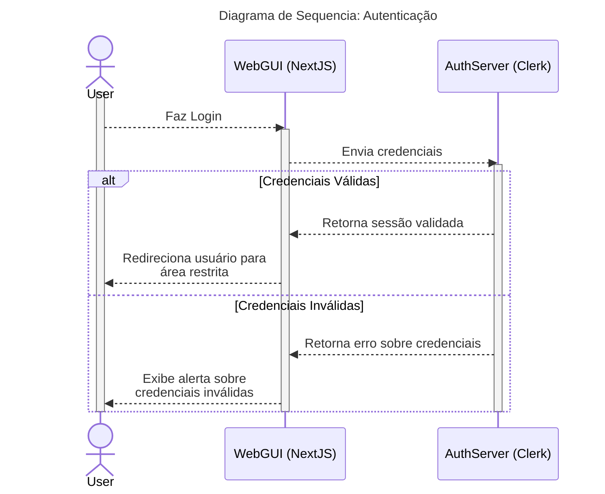

```mermaid
---
title: "Diagrama de Sequencia: Autenticação"
---
sequenceDiagram
  actor User
  participant WebGUI (NextJS)
  participant AuthServer (Clerk)
  
  activate User
  User -->> WebGUI (NextJS): Faz Login
  activate WebGUI (NextJS)
  WebGUI (NextJS) -->> AuthServer (Clerk): Envia credenciais
  activate AuthServer (Clerk)
  alt Credenciais Válidas
      AuthServer (Clerk) -->> WebGUI (NextJS):Retorna sessão validada
      WebGUI (NextJS) -->> User: Redireciona usuário para<br/> área restrita
  else Credenciais Inválidas
      AuthServer (Clerk) -->> WebGUI (NextJS):Retorna erro sobre credenciais
      WebGUI (NextJS) -->> User: Exibe alerta sobre<br/> credenciais inválidas
  end
  deactivate AuthServer (Clerk)
  deactivate WebGUI (NextJS)
  deactivate User
```