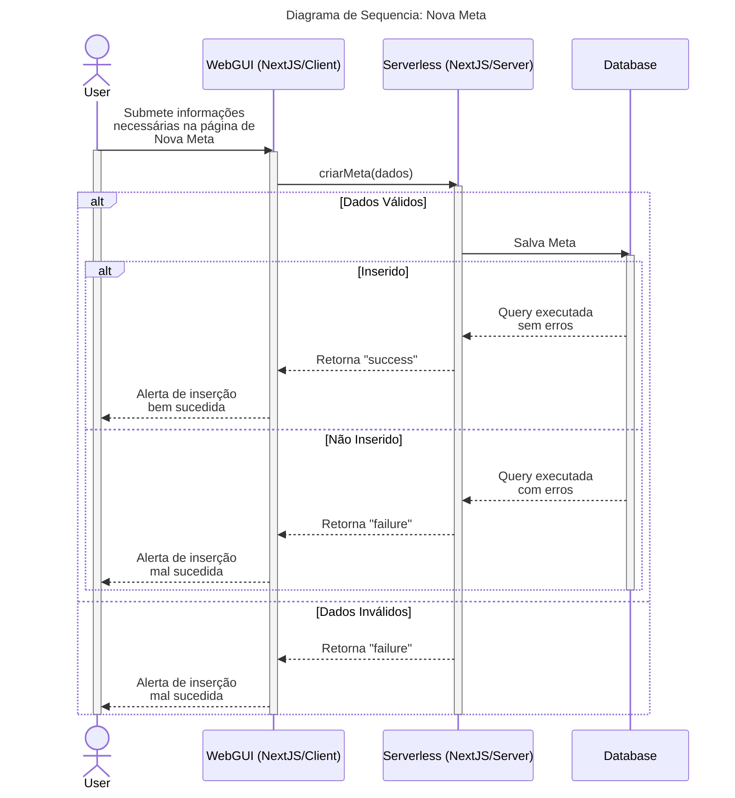

```mermaid
---
title: "Diagrama de Sequencia: Nova Meta"
---
sequenceDiagram
  actor User
  participant WebGUI (NextJS/Client)
  participant Serverless (NextJS/Server)
  participant Database
  
  User ->> WebGUI (NextJS/Client): Submete informações <br/> necessárias na página de <br/> Nova Meta
  activate User
  activate WebGUI (NextJS/Client)
  WebGUI (NextJS/Client) ->> Serverless (NextJS/Server): criarMeta(dados)
  activate Serverless (NextJS/Server)
  alt Dados Válidos
    Serverless (NextJS/Server) ->> Database: Salva Meta
    activate Database
    alt Inserido
      Database -->> Serverless (NextJS/Server): Query executada<br/> sem erros
      Serverless (NextJS/Server) -->> WebGUI (NextJS/Client): Retorna "success"
      WebGUI (NextJS/Client) -->> User: Alerta de inserção<br/> bem sucedida
    else Não Inserido
      Database -->> Serverless (NextJS/Server): Query executada<br/> com erros
      Serverless (NextJS/Server) -->> WebGUI (NextJS/Client): Retorna "failure"
      WebGUI (NextJS/Client) -->> User: Alerta de inserção<br/> mal sucedida
    end
    deactivate Database
  else Dados Inválidos
    Serverless (NextJS/Server) -->> WebGUI (NextJS/Client): Retorna "failure"
    WebGUI (NextJS/Client) -->> User: Alerta de inserção<br/> mal sucedida
  end
  deactivate Serverless (NextJS/Server)
  deactivate WebGUI (NextJS/Client)
  deactivate User
```