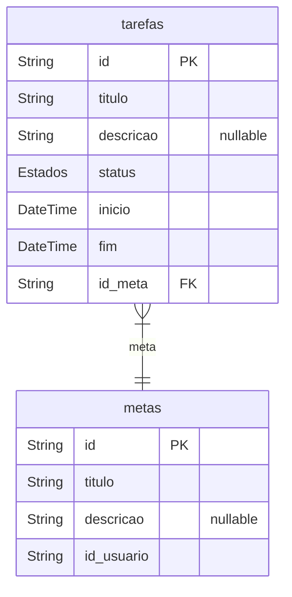

# Sistema Gerenciador de Metas
> Generated by [`prisma-markdown`](https://github.com/samchon/prisma-markdown)

- [Trabalho](#Trabalho)

## Trabalho

### `metas`
Metas são a unidade principal de trabalho, são criadas e gerenciadas por um usuário.

**Properties**
  - `id`: Identificador Exclusivo
  - `titulo`: Título da Meta
  - `descricao`: Descrição da Meta
  - `id_usuario`: Usuário a quem a Meta pertence

### `tarefas`
Tarefas são sub-unidades de trabalho presentes dentro de Metas. Uma Meta pode ter inúmeras Tarefas, porém uma Tarefa pode pertencer apenas a uma Meta

**Properties**
  - `id`: Identificador Exclusivo
  - `titulo`: Título descritivo da Tarefa
  - `descricao`: Descrição longa do que deve ser cumprido na Tarefa
  - `status`: Em que ponto está a execução da Tarefa
  - `inicio`: Data e Hora da primeira modificação de Estado (e.g.: `AGUARDANDO` -> `EMANDAMENTO`)
  - `fim`: Data e Hora da conclusão da Tarefa (e.g.: Estado passa para `CONCLUIDO` ou `CANCELADO`)
  - `id_meta`: Identificador Exclusivo da Meta a qual a Tarefa pertence